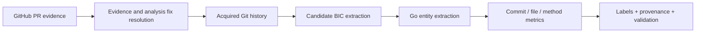

# Architecture

The GitHub adapter calls `gh api`; the repository adapter calls `gh repo
clone` and `git` with argument arrays. Target content is parsed but never
executed. Evidence, extraction, serialization, provenance, and validation are
separate modules so that a candidate relation cannot silently become a metric
or label.

Source classification is a shared component used by SZZ path selection,
commit/file/method extraction, and exclusion reporting. The default
`production_go` SZZ scope accepts exactly the Go paths allowed by the
configured source policy; `all_changed` is an explicit comparison mode.

Fix resolution stores the GitHub merge evidence separately from the revision
used for SZZ and metrics. Reachability, analyzable accepted modifications, and
Git ancestry determine the policy; unresolved cases produce warnings rather
than empty successful fixes.

The figure above is the source-controlled architecture diagram and is referred
to as the “GoBugMiner architecture diagram” in this document.
